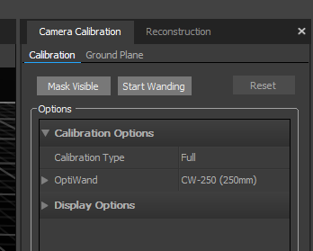
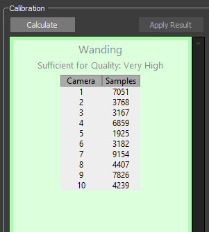
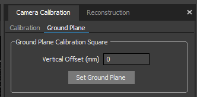
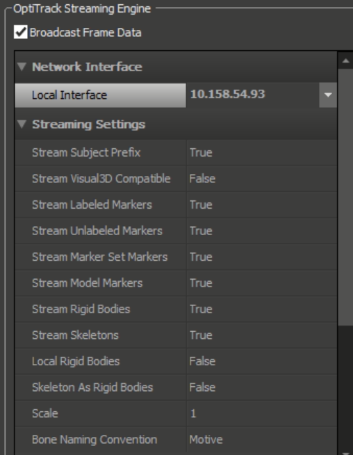
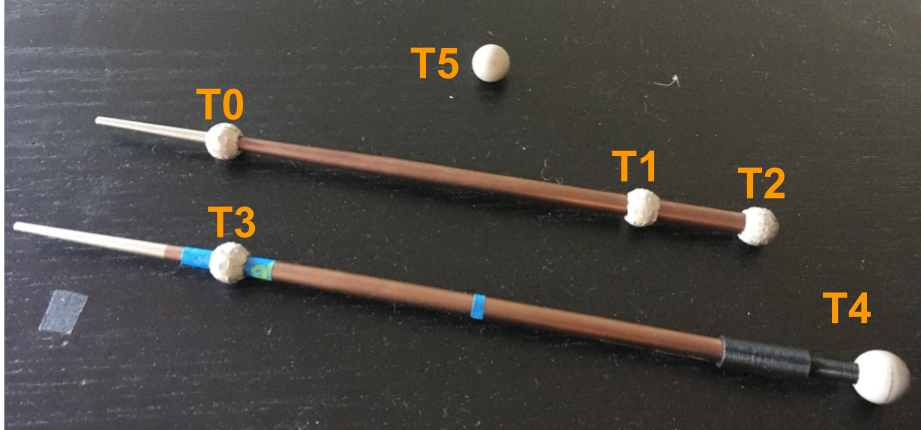

# mocap_optitrack fork

This repo builds on top of `mocap_optitrack` library. It adds support for
- Tracking unlabeled markers based on a naive assignment + filtering method.
- Publishing model markers (that belong to rigid body) along side unlabeled markers

# Calibrating the Mocap System (Wanding)
1. On the Optitrack menu, select Edit -> Reset Application Setting.
2. View -> Calibration
3. Remove or cover anything in the workspace which appears on the cameras. 
4. Click "Mark Visible" in the Camera Calibration pane under Calibration. It will store any existing point as "invalid" points forever (unless you reset the application setting).
5. Select the right wand size in the Camera Calibration pane. Usually we use the 250mm wand.
6. Click “Start Wanding” 
	
7. Move the wand around the workspace. You need to (1) have a good coverage all over the workspace. (2) focus on specific cameras as needed so each camera has at least a thousand samples. (3) focus on the core workspace (e.g. above the workstation and around the robot calibration region)
	
8. After there is at least four thousand samples for each camera, click “Calculate”
5. The Calibration Result should be excellent or exceptional (exceptional is better). Click “Apply” in the Calibration Result pop-up window.
6. Place the Optitrack ground plane on its desginated position on the table.
7. Make sure the three ground plane points are visible. In the Camera Calibration window, under Ground Plane, click “Set Ground Plane”. It will prompt you to save, and you can use the default file name.
	
    
    
# Create Rigid Body

For the tycho robot we usually create two rigid bodies in this order.

First, select the three points belonging to the END EFFECTOR tracker. When selecting the point, starting from the left most one (closest to the tip). Right-click, and select “Rigid Body > Create from Selected Markers”

Second, select the three points belonging to the leader chopsticks. Again, starting from the point that is closest to the tip.

Because of the demo setup, it’s important to create the arm tracker rigid body first, before the chopstick. And it's important to select the markers for the rigid body in the correct order.

# Stream Mocap Data

1. In Optitrack software: Click View -> DataStreaming
2. In the new Streaming window, 

- For the "Network Interface / Local Interface" field write the machine’s IP address. 
- For the “Multicast Interface”, match its value with `multicast_address` in [`config/mocap.yaml`](config/mocap.yaml)

Roughly the settings match those in the pictures below:

    
    

3. Check the data streaming checkbox to start streaming.

# Tycho Teleoperation Demo

1. Ensure you have created the two rigid body as described above.

2. When you launch the teleoperation demo, you will need to place the leader chopsticks at a designated area on the table. To track the points on those chopsticks, you need to specify their initial tracking positions in [`config/mocap.yaml`](config/mocap.yaml). Edit this file so that `T3` and `T4` markers have their init_pos match the starting points of the chopstick with two markers, and `T5` (or `Ball`) reflects the position of the tracking ball to pick up.
	 

3. Notes: the software transforms point poses from optitrack frame to map frame in `mocap_datapackets.cpp`, `get_3d_point()`. Currently we do not modify the transformation. Instead. we rely on an explicit calibration (hebi_calibration) to find the correct transformation. The client side will apply the transformation as needed.

4. Currently, we broadcast tf for the transformation between optitrack frame and the robot frame: e.g. `rosrun tf static_transform_publisher 0 0 0 0 0 1.5708 map optitrack_natnet 1000`

5. You can launch the tracking code: `roslaunch mocap_optitrack mocap.launch`

## Tips

1. Tweak `trackMarkers` function defined in `mocap_node`, especially the constant number. This might improve the tracking of unlabeled markers when facing marker occlusion / marker went too fast.
